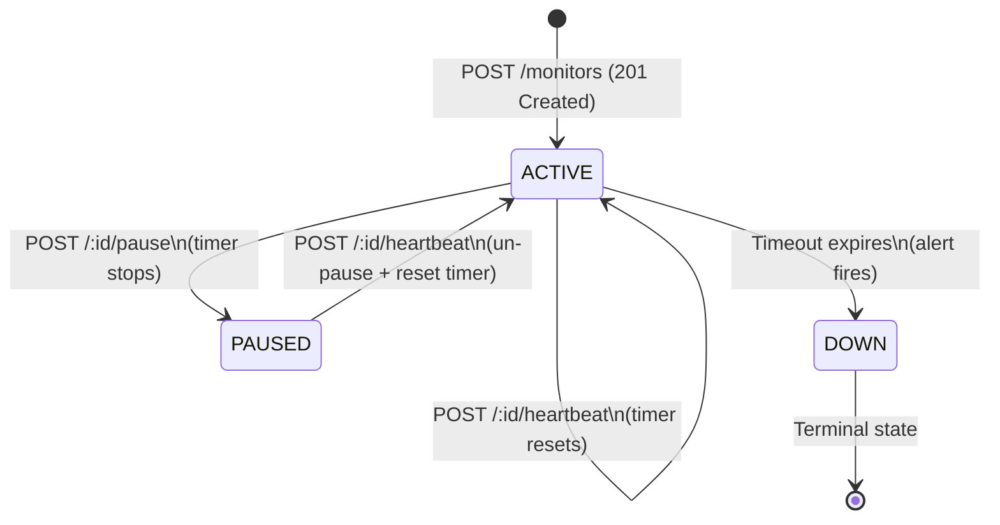

# Watchdog Sentinel API

A **Dead Man's Switch** backend service for CritMon Servers Inc. Devices register a monitor with a timeout. If they stop sending heartbeats before the timer expires, an alert fires automatically.

---

## Architecture Diagram

The diagram below shows the full monitor lifecycle — from registration through active heartbeating, optional pausing, and the failure (down) state.



### Request / Response Flow

```
Device                        Watchdog API                    Alert System
  │                               │                               │
  │  POST /monitors               │                               │
  │ ────────────────────────────► │  starts countdown timer       │
  │  201 Created                  │                               │
  │ ◄──────────────────────────── │                               │
  │                               │                               │
  │  POST /monitors/:id/heartbeat │                               │
  │ ────────────────────────────► │  resets countdown timer       │
  │  200 OK                       │                               │
  │ ◄──────────────────────────── │                               │
  │                               │                               │
  │       [no heartbeat]          │                               │
  │                            timeout                            │
  │                               │  console.log JSON alert ────► │
  │                               │  status → "down"              │
```

---

## Setup Instructions

### Prerequisites

- Node.js v18 or higher
- npm

### Install & Run

```bash
# 1. Clone the repository
git clone https://github.com/oseitutunelson/watchdog-sentinel-api.git
cd watchdog-sentinel-api

# 2. Install dependencies
npm install

# 3. Start the server
npm start
```

The server starts on **http://localhost:3000** by default.

To use a different port:

```bash
PORT=8080 npm start
```

For development with auto-reload (Node.js v18+):

```bash
npm run dev
```

---

## API Documentation

All request bodies must use `Content-Type: application/json`.

---

### POST `/monitors`

Register a new device monitor and start its countdown.

**Request body**

```json
{
  "id": "device-123",
  "timeout": 60,
  "alert_email": "admin@critmon.com"
}
```

| Field | Type | Required | Description |
|---|---|---|---|
| `id` | string | ✓ | Unique device identifier |
| `timeout` | number | ✓ | Countdown duration in **seconds** |
| `alert_email` | string | ✓ | Email to notify on alert (logged for now) |

**Response — 201 Created**

```json
{
  "message": "Monitor for 'device-123' created. Countdown started: 60s.",
  "monitor": {
    "id": "device-123",
    "timeout": 60,
    "alert_email": "admin@critmon.com",
    "status": "active",
    "createdAt": "2025-06-01T12:00:00.000Z",
    "updatedAt": "2025-06-01T12:00:00.000Z",
    "lastHeartbeat": null
  }
}
```

**Errors:** `400` (missing/invalid fields), `409` (monitor ID already exists)

---

### POST `/monitors/:id/heartbeat`

Send a heartbeat to reset the countdown. Also un-pauses a paused monitor.

**Example**

```bash
curl -X POST http://localhost:3000/monitors/device-123/heartbeat
```

**Response — 200 OK**

```json
{
  "message": "Heartbeat received. Timer reset to 60s.",
  "monitor": {
    "id": "device-123",
    "status": "active",
    "lastHeartbeat": "2025-06-01T12:00:45.000Z",
    ...
  }
}
```

**Errors:** `404` (monitor not found), `409` (monitor is already down)

---

### POST `/monitors/:id/pause`

Pause monitoring. The timer stops completely. No alerts will fire.  
Calling `heartbeat` again automatically un-pauses and restarts the timer.

**Example**

```bash
curl -X POST http://localhost:3000/monitors/device-123/pause
```

**Response — 200 OK**

```json
{
  "message": "Monitor 'device-123' paused. No alerts will fire.",
  "monitor": {
    "id": "device-123",
    "status": "paused",
    ...
  }
}
```

**Errors:** `404` (not found), `409` (already down)

---

### GET `/monitors/:id` ✦ Developer's Choice

Query the current status and metadata of any monitor.

**Example**

```bash
curl http://localhost:3000/monitors/device-123
```

**Response — 200 OK**

```json
{
  "monitor": {
    "id": "device-123",
    "timeout": 60,
    "alert_email": "admin@critmon.com",
    "status": "active",
    "createdAt": "2025-06-01T12:00:00.000Z",
    "updatedAt": "2025-06-01T12:00:45.000Z",
    "lastHeartbeat": "2025-06-01T12:00:45.000Z"
  }
}
```

**Errors:** `404` (not found)

---

### GET `/monitors`

List all registered monitors and their current status.

**Example**

```bash
curl http://localhost:3000/monitors
```

**Response — 200 OK**

```json
{
  "monitors": [
    { "id": "device-123", "status": "active", ... },
    { "id": "device-456", "status": "down", ... }
  ]
}
```

---

### DELETE `/monitors/:id`

Remove a monitor permanently (e.g., device decommissioned). Cancels any running timer.

**Example**

```bash
curl -X DELETE http://localhost:3000/monitors/device-123
```

**Response — 200 OK**

```json
{ "message": "Monitor 'device-123' deleted." }
```

**Errors:** `404` (not found)

---

### GET `/health`

Health check endpoint for container orchestration / load balancers.

```json
{ "status": "ok" }
```

---

## Alert Behavior

When a monitor's timer reaches zero with no heartbeat received, the system:

1. Sets `status` to `"down"`
2. Cancels the internal timer
3. Logs a JSON alert to stderr:

```json
{
  "ALERT": "Device device-123 is down!",
  "alert_email": "admin@critmon.com",
  "time": "2025-06-01T12:01:00.000Z"
}
```

> To integrate real email/webhook delivery, replace the `console.error` call in `src/monitors.js → fireAlert()` with your notification provider of choice.

---

## Developer's Choice: `GET /monitors/:id` Status Endpoint

### What I added

A read-only `GET /monitors/:id` endpoint that returns the current state, metadata, and last heartbeat timestamp for any registered monitor.

### Why it matters

The core spec defines how devices *write* to the API (register, ping, pause) but provides no way to *read* back the state. In a real operations environment this is the first thing a support engineer reaches for:

- **Dashboards** need to poll monitor state to display live status boards.
- **Incident response** — when an alert fires at 3am, the on-call engineer needs to immediately confirm the device is truly down vs. a network blip, without digging through logs.
- **Integration testing** — verifying that a heartbeat actually reset the timer requires reading the updated `lastHeartbeat` field back.
- **Automation** — runbooks and scripts that conditionally pause/unpause monitors must first check current status to avoid 409 errors.

A write-only API is a black box. Adding this endpoint costs one route and zero business logic, but makes the entire system observable.

---

## Project Structure

```
watchdog-sentinel-api/
├── src/
│   ├── server.js      # Express app setup and entry point
│   ├── routes.js      # All HTTP route handlers
│   └── monitors.js    # In-memory store and timer logic
├── .gitignore
├── package.json
└── README.md
```

---

## Notes & Limitations

- **Storage is in-memory.** All monitors are lost when the server restarts. For production, persist state to Redis or a database.
- **Single process.** Node.js `setTimeout` is not suitable for multi-instance deployments — use a distributed scheduler (BullMQ, Redis ZSET, etc.) in production.
- **No authentication.** Add API key middleware before deploying externally.
